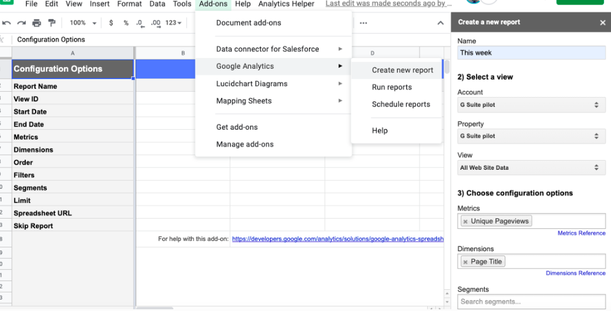

# Build a Google Analytics dashboard 🖥️ with an Apps Script, a Sheets add-on, and Google Sites

This is an Apps Script sample created by a macro that records a users steps in
order to automate the setup and chart summarization process when using the Google
Analytics add-on in Google Sheets.
Macro recording is a great alternative if you do not feel comfortable writing
JavaScript or wish to save time in writing out the logic by hand.
Multiple scripts output from macro recording can be executed as a custom
menu by a user, including those who make a copy of the sheet and then instal
the Google Analytics-add-on.

Charts can optionally be inserted into a new Google Site and be scheduled to
run on a routine basis to share data in a professional dashboard outside of a
Google spreadsheet for presentation purposes.

For more information visit:

- [Macro recording in sheets](https://developers.google.com/apps-script/guides/sheets/macros)
- [Google Analytics add-on](https://developers.google.com/analytics/solutions/google-analytics-spreadsheet-add-on)

**What you need:**

1. A Google Analytics account that has been collecting data from a website.
1. A Google Sheet created by the same Google account that has access to your
   Google Analytics account.

For full instructions with screenshots please visit
[this blog post.](https://medium.com/@TechandEco/apps-script-macro-to-automate-daily-google-analytics-reports-%EF%B8%8F-in-a-google-sheet-668263ab6c8c)

