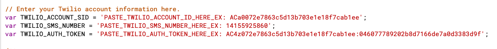

# Send SMS event updates or discount codes via Twilio from a Google Sheet

- Follow me on
  [Twitter](https://twitter.com/TechandEco)
- Visit this solution's 
  [blog post with screenshots here](https://medium.com/@TechandEco/send-sms-event-updates-or-discount-codes-using-twilio-from-a-google-sheet-fd1ebd24c4e)

## Introduction

This is an Apps Script solution to help folks who want to send customized text
messages from a Google Sheet. It requires two separate scripts:

1. Web app:
  [standalone script](https://developers.google.com/apps-script/guides/standalone)
   for the webapp to gather phone numbers for the database
1. SMS sender:
   [container bound](https://developers.google.com/apps-script/guides/bound)
   script to a spreadsheet containing the database where you can send SMS
   messages from a menu button.

If you do not wish to maintain a web app, you can link a Google Form to the
Sheet and only collect one value from users called _phone number_ in order to
use the script _as is_.

## Prerequisite

- Access to creating a Google Sheet
- Create a Twilio account (free trial comes with $15 to spend).

    1. [Create a Twilio account](https://support.vision6.com.au/hc/en-us/articles/230673727-Text-Messaging-Account-Setup-with-Twilio)
        (free trial comes with $15 to spend).
    1. Buy an SMS enabled phone number for $1
       [listed in step 3 here](https://support.vision6.com.au/hc/en-us/articles/230673727-Text-Messaging-Account-Setup-with-Twilio)
       (it’s within the trial’s free spend)
    1. Visit
       [Twilio dashboard](https://www.twilio.com/console)
       to locate API credentials
       [step 4 here](https://support.vision6.com.au/hc/en-us/articles/230673727-Text-Messaging-Account-Setup-with-Twilio)

## Try it

1. Create the web app
    1. Visit
       [Script.google.com](https://script.google.com/u/1/home) > New script
    1. Replace the existing code (if any) with
       [the code in the Code.gs tab](webapp/Code.js)
        - Then save (File > Save)
        - Create another file by clicking File > New > HTML file> call it
          “Page.html” and paste the code from the
          [Page.html tab here.](webapp/Page.html)
        - Then save (File > Save)

1. [Copy this Google Sheet](https://docs.google.com/spreadsheets/d/1A0YN5Ps2Iq-yTHvBPXwrz61HBXA0ZWgIML911ub6B3o/copy)
    1. Copy the Sheet’s URL from the browser
    1. Visit the web app’s script
    1. Enter the URL of your spreadsheet at the top.

1. Publish web application
    1. Click Publish > Deploy as a web app > Deploy (leave all the default
       options selected).
    1. Copy the URL of the deployed web app and paste it in a new tab in your
       broswser.
    1. This will bring up the web app that looks like this:
    

1. Return to web app’s script on the
   [Code.js file](webapp/Code.js)
    - Select from the function drop-down “doGet” and click the Run button (►).

1. Return to your spreadsheet
    1. Click Tools > Script editor
    1. At the top of the code replace the contents with your own Twilio Account
       ID, Auth token, and the phone number you purchased from Twilio.
       
1. Enter data via the web app
    - Visit the tab with the web app and enter the phone number you used to
      create the Twilio account and click “Submit.

1. Return to the spreadsheet and see your phone number and the
    time you entered logged in the sheet.
    > Optional if you do not wish to enter phone numbers via the web app you
    > can directly enter the phone numbers manually in the “Phone number”
    > column. This is possible since the web app simply appends new data off
    > the last row of data entered in the sheet, so it dynamically adapts.

1. Prepare message and authorize the script to send SMS
    1. Refresh the Google Sheet.
    1. Enter a message in the “Message” column (ex: “Hi this is a message”)
    1. A new menu at the top of the sheet called “Send SMS”  should have been
       displayed after a few seconds after refreshing the sheet.
    1. Click Send SMS menu > Send to All
    1. When prompted, click the "Review permissions" and click "Allow" so the
       script can send texts on your behalf.
        > Note: If you get a warning that "This app isn't verified,"
        > continue with the verification process by clicking "Advanced" and
        > then scroll down and click the grey text at the bottom that begins
        > with "Go to..."
    1. A text message should have been sent to your phone and the “Status”
       column should have been updated with “Sent” and the date.

1. [OPTIONAL] Continue to send messages moving forward.
    1. Via Twilio trial
        - If you wish to send more messages via the Twilio trial, you can only
          do so to your personal phone. You can continue to enter that number
          via the web app or enter it manually in the sheet and simply change
          the message in the “Message” column to something new.
    1. Via Twilio membership
        - You can continue to use this script if you purchase a Twilio account
          in order to send messages to phone numbers other than your own.

## Helpful resources

- [Web apps on top of Google scripts](https://developers.google.com/apps-script/guides/web)
- [Standalone script (unbound) App Script](https://developers.google.com/apps-script/guides/standalone)
- [Container bound script (tied to Sheet) Apps Script](https://developers.google.com/apps-script/guides/bound)
- [Twilio's SMS instructions](https://www.twilio.com/blog/2016/02/send-sms-from-a-google-spreadsheet.html)
- [Public Google Sheets Web App Tutorial](https://youtu.be/RRQvySxaCW0)
